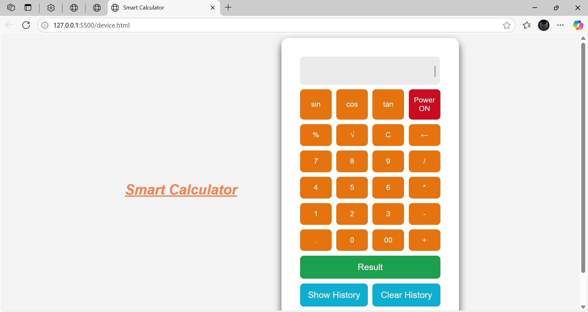
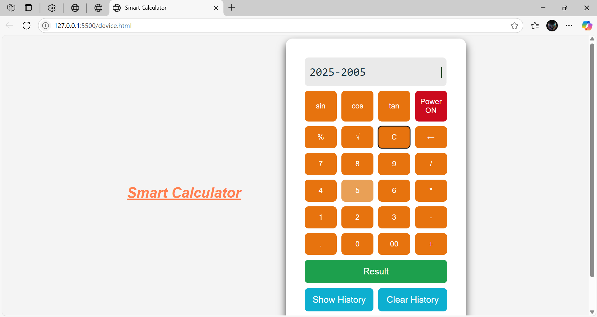

# Simple Calculator Web 

A responsive web-based calculator with scientific functions, history tracking, and keyboard support.

## Features
- Basic arithmetic operations (+, -, *, /)
- Scientific functions (sin, cos, tan, √, %)
- Power on/off toggle
- Calculation history with timestamp
- Last result display
- Keyboard support
- Responsive design

## Technologies Used
- *Frontend*: HTML5, CSS3, JavaScript (ES6)
- *Storage*: LocalStorage for persistent history
- *Animation*: CSS keyframe animations

## How to Use
1. Open device.html in any modern browser
2. Click "Power ON" to start (already enabled by default)
3. Use buttons or keyboard to enter expressions:
   - Numbers: 0-9 keys
   - Operators: +, -, *, / 
   - Functions: sin, cos, tan, √, %
   - Enter/Return: Calculate result
   - Backspace: Delete last character
   - C: Clear display
4. View history with "Show History" button
5. Clear history with "Clear History" button

## Screenshot

